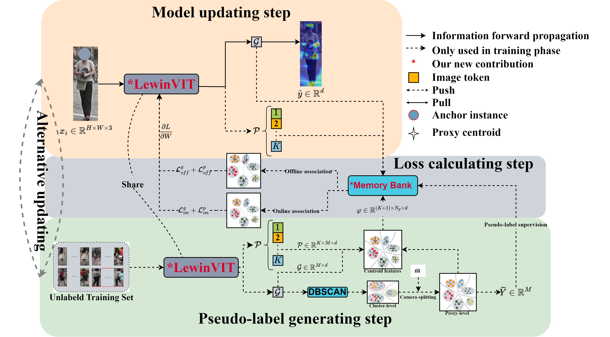

# LWTGPF-Unsupervised Learning-Person Re-ID
Unsupervised person Re-ID has gained more favor due to its potential for label-free applications. The core of unsupervised learning is to extract deep representations of persons from a backbone that are then generated pseudo-labels by the standard clustering methods. However, the changes of cameras and the ill-posed nature of person features lead to noisy pseudo-labels. To this end, this work proposes a novel unsupervised learning system, called Local enhancing Window vision Transformer with camera-aware based on Global-Part Features (LWTGPF). LWTGPF consists of 2 new components: the Local Enhancing Window Vision Transformer (LewinVIT) and the Global-Part Off/On-line associated Camera-Aware Proxy learning framework (GP-O2CAP). LewinVIT captures the contextual semantics of the image through a hierarchical structure and models the global-local relationships of the image via window-based attention. Moreover, we create a copy of the final stage of LewinVIT to construct a dual-branch structure for building fine-grained features of persons. Correspondingly, GP-O2CAP fine-tunes the top-performing unsupervised learning framework, O2CAP, where both global/part-level features are used to obtain the proxy-level centroids. Off/on-line contrastive learning losses are redefined to achieve end-to-end unsupervised learning. Extensive experiments on 4 standard and occluded person Re-ID benchmarks demonstrate that LWTGPF achieves state-of-the-art performance in unsupervised methods and further narrows the gap with supervised learning.

# Contents
- [Preliminary🔧](#Preliminary)
- [Pretrain📂](#Weights)
- [Datasets🔔](#Datasets)
- [How to Run💻](#Run)
- [Acknowledegements🙏](#Acknowledegements)
- [License🔑](#License)


# Preliminary🔧
**Overall framework**  

**It seems to be successful only under Linux**
```
pip install faiss-gpu 
git clone https://github.com/YanJieWen/LWTGPF-2025.git
```

# Pretrain📂
## Luperson prertrained
[](https://github.com/tinyvision/SOLIDER?tab=readme-ov-file)  
[](https://github.com/DengpanFu/LUPerson)  
[](https://github.com/damo-cv/TransReID-SSL/tree/main)

## Imagenet pretrained
[](https://github.com/huggingface/pytorch-image-models-timm)

Putting them into the 📂[pretrain](pretrain)-->generate `imagenet` and `luperson`


# Datasets🔔
We provide 4 banchmarks in [configs](configs), before run our project, please donwload datasets and put them into the [benchmarks](benchmarks)  
[Market1501](https://www.kaggle.com/datasets/pengcw1/market-1501/data)  
[DukeMTMC](https://github.com/lightas/ICCV19_Pose_Guided_Occluded_Person_ReID)  
[CUHK03](http://www.ee.cuhk.edu.hk/~xgwang/CUHK_identification.html)  
[OccDuke](https://github.com/lightas/Occluded-DukeMTMC-Dataset)


# How to Run💻
## Training
**After installing the data and weights**  
change the [train.py][train.py], `line 31`  corresponding to the [configs](configs)
```
python train.py
```


## Evaluating

## Analysis


# Acknowledegements🙏


# License🔑

